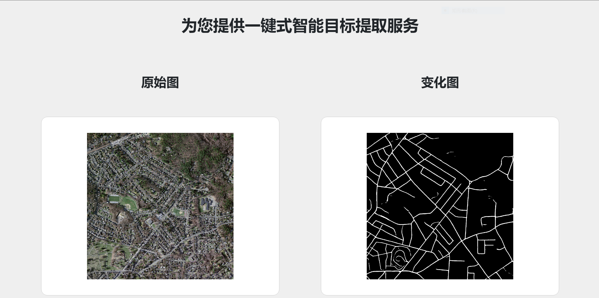
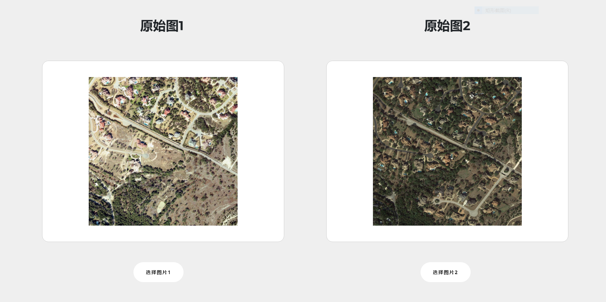
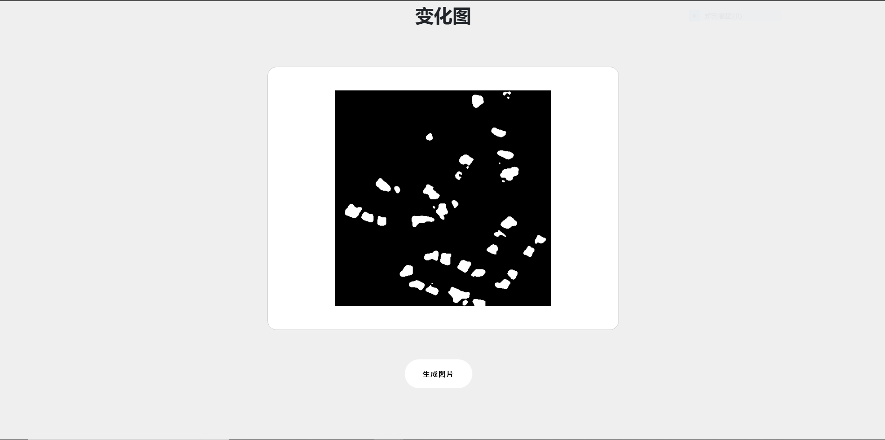
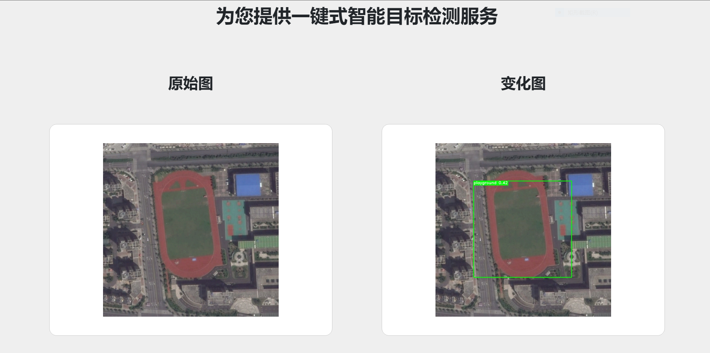
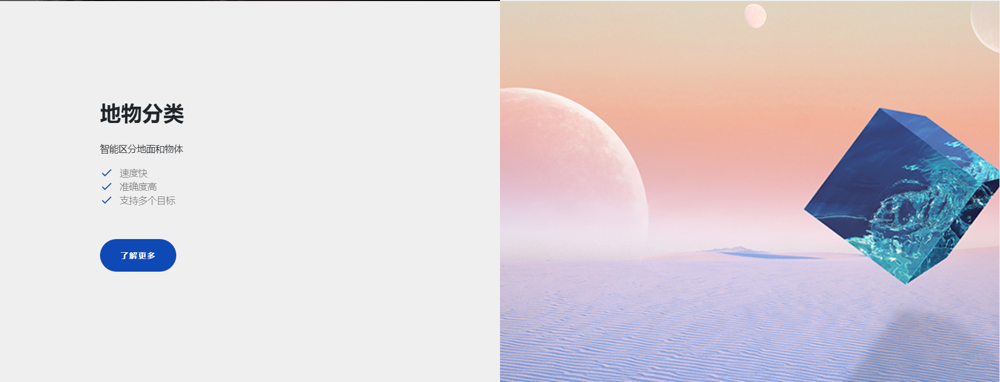
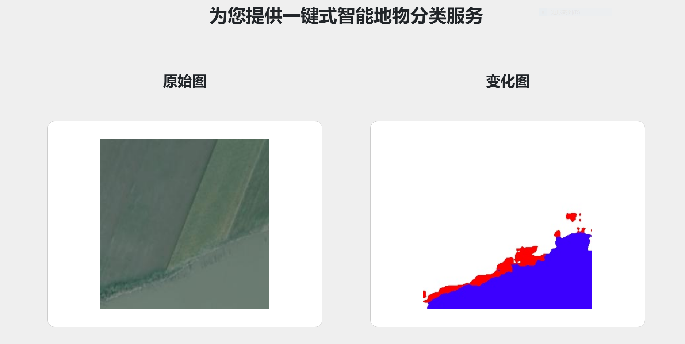

<div align="center">
<h1> 智云盎-基于百度飞桨的遥感图像智能解译平台</h1>
</div>
<div align="center">
  <p align="center">
    
  </p>

  **基于飞桨框架开发的高性能遥感图像处理Web平台，快捷方便实现遥感图像推理需求。**

[//]: # (  [![Build Status]&#40;https://travis-ci.org/PaddleCV-SIG/PaddleRS.svg?branch=release/0.1&#41;]&#40;https://travis-ci.org/PaddleCV-SIG/PaddleRS&#41; )

[//]: # (  [![Version]&#40;https://img.shields.io/github/release/PaddleCV-SIG/PaddleRS.svg&#41;]&#40;https://github.com/PaddleCV-SIG/PaddleRS/releases&#41;)
  [](LICENSE)
  
  
</div>

[//]: # (## 最新动态 )

[//]: # ()
[//]: # (*  [2022-05-19] 🔥 PaddleRS发布1.0-beta版本，全面支持遥感领域深度学习任务。详细发版信息请参考[Release Note]&#40;https://github.com/PaddleCV-SIG/PaddleRS/releases&#41;。)

## 背景简介

遥感数据具有覆盖范围及时域广、获取迅速、动态信息强等特点，已广泛应用于城市规划、气象预测、环境保护、防灾减灾、农林业监测等领域并取得了良好的经济和社会效益。近年来，随着遥感技术的进一步发展和新一代高分辨率卫星系统相继投入应用，我国遥感领域已步入了高分辨率影像的快车道，对遥感数据的分析应用服务需求与日俱增。传统方式对高分辨率卫星遥感图像的特征刻画能力差且人工成本高。随着人工智能及深度学习技术快速发展，通过应用深度学习技术可以加速遥感领域智能化应用，促进遥感数据处理走向智能化，使我国遥感事业更好地服务国计民生。


## 特性

* **推理使用方便**：`智云盎`针对遥感行业数据图片信息，提供了大尺幅数据图片在线推理功能，支持读取`png`、 `jpeg`、`jpg`等图片格式，在线推理图片。

* **覆盖功能广**：`目标提取`（使用图像分割技术对卫星图像中指定对象完成分割） 、
`变化检测`变化检测（使用图像分割技术对同区域两个时期的卫星图像变化情况完成分析）、
`目标检测`目标检测（使用目标检测技术对卫星图像中指定对象完成检测）、
`地物分类`地物分类（使用图像分割技术对卫星图像每个像素完成分类）等遥感图片处理功能，提供功能众多。

* **高推理性能**：使用`Linux18.04`作为服务器系统、使用`NVIDIA® T4 GPU`作为云端工作的推理设备，提供高性能推理计算能力。

## 提供服务

* **变化检测功能**：智云盎针对遥感数据图片信息，提供对同区域两个时期的卫星图像变化情况分析的功能，支持读取`png`、 `jpeg`、`jpg`等图片格式。

* **目标检测功能**：智云盎针对遥感数据图片信息，提供对卫星图像中运动场对象检测的功能，支持读取`png`、 `jpeg`、`jpg`等图片格式。

* **地物分类功能**：智云盎针对遥感数据图片信息，提供对卫星图像每个像素进行地物分类的功能，支持读取`png`、 `jpeg`、`jpg`等图片格式。

* **目标检测功能**：智云盎针对遥感数据图片信息，提供对卫星图像中道路对象分割的功能，支持读取`png`、 `jpeg`、`jpg`等图片格式。

### 代码结构

这部分将展示SoftwareCupA4的文件结构全貌。文件树如下：

```
├── a4project             # 项目源代码文件
│     ├── a4project       # Web服务器端口、路由、wsgi等配置文件
│     ├── demo_data       # 测试图片
│     ├── deploy_model    # 推理的模型文件
│     ├── PaddleRS        # PaddleRS源码文件
│     ├── predictapi      # 功能模型的推理api源码
│     ├── static          # 静态资源文件
│     │     ├── css       # 页面样式文件
│     │     ├── images    # 页面图片文件
│     │     └── js        # 页面js文件
│     ├── templates       # 前端html模板文件
│     └── zya             # Web基础功能源码文件
└── docs                  # 整个项目文档及图片    

```

## 使用教程 

* 环境准备
   * 下载python 3.7及以上版本，具体请参考 [python](https://www.python.org/downloads/) 查看安装前的准备及安装过程。
   * 下载安装cuda 11.2 ，具体请参考[nvidia CUDA](https://developer.nvidia.com/cuda-11.2.0-download-archive) 查看安装。
   * 在./SoftwareCupA4/a4project目录下，使用pip安装： `pip install -r requirements.txt`下载项目运行依赖包。
* 增加模型及测试文件
   * 将压缩包model.zip文件进行解压，将demo_data、deploy_model添加到./SoftwareCupA4/a4project目录中。
* 项目运行
   * 然后终端下执行:
   * ```bash
        python manage.py makemigrations
        python manage.py migrate
     ```

   * 创建超级用户，在终端下执行:
   * ```bash
        python manage.py createsuperuser
     ```
   * 开始运行，在终端下执行:
   * ```bash
       python manage.py runserver
     ```
   * 浏览器打开: http://127.0.0.1:8000/  就可以运行本项目。  
   

## 运行效果展示 

* 首页
  <div>
    <p>
      
    </p>
  </div>
  
* 目标提取
    <div>
      <p>
        
        
      </p>
    </div>
  
* 变化检测
      <div>
        <p>
          
          
          
        </p>
      </div>

* 目标检测
        <div>
          <p>
            
            
          </p>
        </div>

* 地物分类
        <div>
          <p>
            
            
          </p>
        </div>

## 具体详细文档


## 开源贡献

* 非常感谢百度飞桨和北航LEVIR 团队等单位对本项目的数据贡献。注：排名不分先后。
* 非常感谢[目标检测](https://github.com/geoyee)(陈奕州), [变化检测](https://aistudio.baidu.com/aistudio/projectdetail/3684588?ticket=f89b1634de0e4e60a203d82e39558a9b&alertTip=&qq-pf-to=pcqq.group)(古代飞), [目标提取](https://github.com/Bobholamovic)(林漫晖), [地物分类](https://github.com/kongdebug)(孔远杭)等开源开发项目对智云盎项目的贡献。


