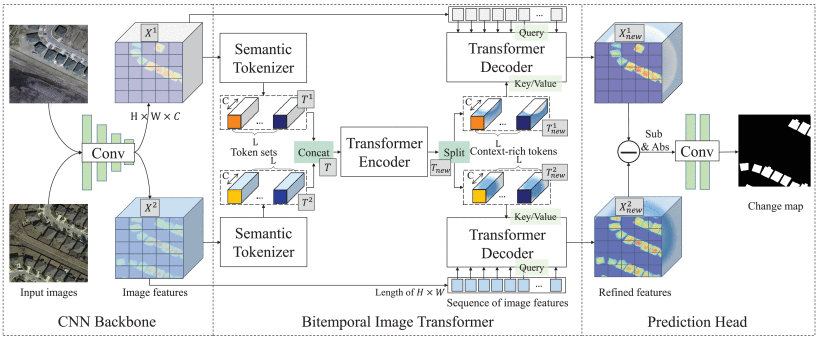
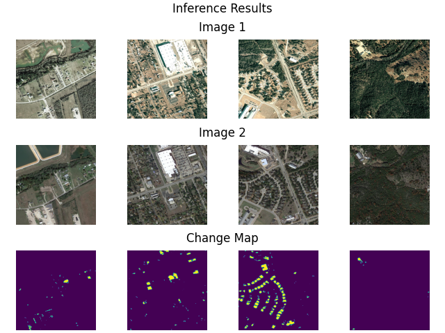
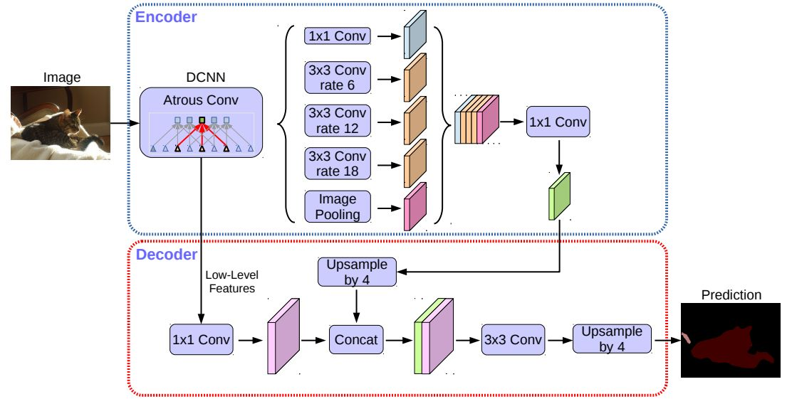
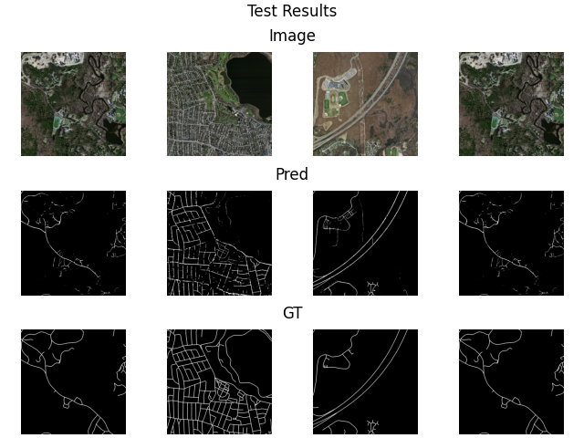
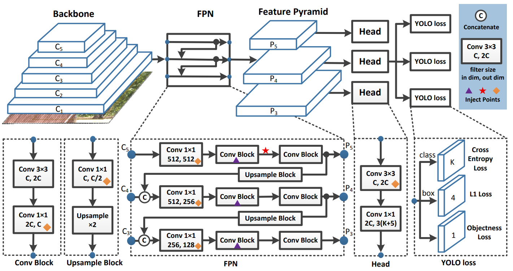
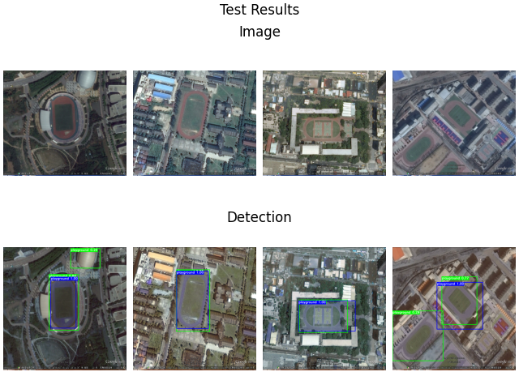
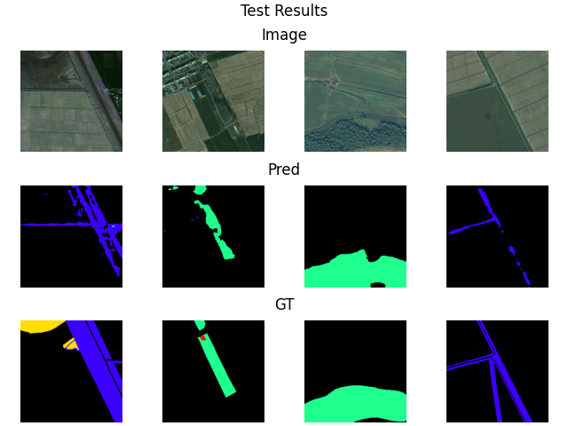

<div align="center">
<h1> 智云盎-基于百度飞桨的遥感图像智能解译平台详细技术文档</h1>
</div>

## 项目介绍


## 背景背景


## 平台介绍


## 应用场景


## 5. 技术路线
### 5.1 模型训练与部署
#### 5.1.1 百度飞桨开源深度学习平台
百度飞桨（PaddlePaddle）以百度多年的深度学习技术研究和业务应用为基础，集深度学习核心训练和推理框架、基础模型库、端到端开发套件、丰富的工具组件于一体，是中国首个自主研发、功能丰富、开源开放的产业级深度学习平台。

飞桨是百度公司经13年研发与及积累而构建的人工智能基础平台与核心技术，作为国内首个自主研发、开源开放、功能完备的深度学习平台，让应用人工智能技术的门槛更低、成本更少、效率更高，对于推进自主可控的人工智能产业发展具有重要意义。

#### 5.1.2 PaddleRS 高性能遥感图像处理开发套件

PaddleRS是遥感科研院所、相关高校共同基于飞桨开发的遥感处理平台，支持遥感图像分类，目标检测，图像分割，以及变化检测等常用遥感任务，帮助开发者更便捷地完成从训练到部署全流程遥感深度学习应用。

本项目的深度学习算法设计均使用基于PaddlePaddle飞桨框架开发的遥感图像处理框架，该套件能够在百度AI Studio平台上较好的适配，便于使用百度飞桨提供的高算力显卡进行模型的训练与部署测试。本项目使用该框架提供的多个SOTA模型作为基础，对模型进行进一步修改，从而在多个遥感图像解译任务上都取得了比较好的效果。

#### 5.1.3 变化检测算法设计
本项目变化检测算法的实现基于LEVIR小组于2021年发布的作品——基于Transformer的遥感图像变化检测模型BIT-CD，原论文[链接](https://ieeexplore.ieee.org/document/9491802)
，原作者官方实现的[链接](https://github.com/justchenhao/BIT_CD)
。BIT-CD模型是目前遥感变化检测领域的SOTA模型之一，通过提出一种双时相图像转换器，更高效的通过非局部自注意力机制对时空域内的上下文进行建模。这种设计使得BIT-CD在三个变化检测数据集上，依靠无复杂结构的朴素骨干网络取得了超远多个SOTA算法的效率和准确度。

本项目在官方提供的Baseline基础上进行模型结构、数据集增强、后处理设计等多方面的增强，并利用飞桨平台提供的后台任务等功能提高训练速度，达到了F1得分0.87944，其分割准确率在测试集上更是达到了92%的效果。基于本项目实现方法在AI Studio平台开源的两个适用于比赛的子项目（[链接](https://aistudio.baidu.com/aistudio/projectdetail/4014610?contributionType=1)
）也取得了超过70次Fork。

BIT-CD的模型示意见下图



变化检测效果见下图



#### 5.1.4 目标提取算法设计

本项目的目标提取算法数据集使用Massachusetts Roads道路提取数据集，该数据集的训练集包含804幅大小为1500x1500的三波段影像，每幅影像均配有道路提取标签。

目标提取算法基于DeepLab V3+模型开发，该模型是一个基于DeepLab V3设计的语义分割网络，在其基础上添加了一个简单但非常有效的Decoder解码器对模型结果，尤其结果中的边界进行细分，从而得到更好的检测效果。

DeepLab V3+模型示意见下图



目标提取效果见下图



#### 5.1.5 目标检测算法设计

本项目的目标检测算法使用RSOD遥感影像目标检测数据集，该数据集是由武汉大学于2017年发布的数据集，其中包含共4种类型的遥感地物目标。

目标检测算法使用百度研发的基于PaddlePaddle的高效目标检测器PP-YOLO，作为YOLO系列中比较新的一代模型，其吸纳了多种能提高速度和准确率的技术，并在YOLOv3的基础上进行了许多种改进，以达到一个比较好的效果。另外，基于经过大数据集预训练过的PP-YOLO模型进行训练的结果能取得更优异的结果。

PP-YOLO模型示意见下图



目标检测效果见下图



#### 5.1.6 地物分类算法设计

本项目的地物分类算法使用了飞桨常规赛：遥感影像地块分割赛题中使用的数据集，旨在对遥感影像进行像素级内容解析，对遥感影像中感兴趣的类别进行提取和分类。数据集中包含了建筑、道路、林地等多个类别，用于衡量模型对遥感影像的分割效果。

本项目地物分类算法同样基于DeepLab V3+模型开发，通过对数据输入输出部分进行处理和修改，DeepLab模型能够对本项目的需求较好的适配。

地物分类效果见下图


#### 5.1.7 深度学习模型部署

本项目的遥感图像解译算法全部基于PaddleRS进行开发，因此对于PaddleRS的部署方案能够完美适配。PaddleRS对其模型使用Paddle Inference作为底层，对其推理部分进行了封装。将训练时使用的动态图结构通过PaddleRS提供的转换工具转换为静态图后，即可与后端代码进行适配，从而得到快速、准确的推理模型。

在本项目中模型的部署部分，基于统一的封装方式对4个不同功能的模型分别封装。通过向后端程序暴露特定方法，保证后端开发成员可以通过对Predictor类的方法调用进行推理。

为防止异常数据导致推理过程出现问题，在模型的静态图转换和Predictor推理方法中分别设置了针对异常数据的检查和处理方法，保证推理功能持续稳定运行。

### Web后端


### Web前端

1. 概述
   
   采用[Scss](https://www.sass.hk/)、[Bootstrap](https://www.bootcss.com/)、[Glightbox](https://biati-digital.github.io/glightbox/)、[Jquery](https://jquery.com/)来辅助构建整体的网页界面

   用Djano来搭建网页之间的路由
3. 总体设计
   1. 首页
   
   1. 功能页面
      1. 目标提取
      
      2. 变化检测
      
      3. 目标检测
      
      4. 地物分类
      
   5. 关于我们
   
4. 功能实现
   1. 滚动动画
      
      通过JQuery动画库进行设计实现

   2. 小窗口动画
   
      通过Glightbox实现

   3. 动画延时
      
      通过js的counter计数器来实现对时间的计时，再通过函数判断进行延时

   4. 导航栏
   
      
      通过Bootstrap帮助设计实现

   5. 数据通信
      
      通过ajax来向服务器发起POST请求输出图片Base64加密后，通过json进行传输
      ```
      function post(){
		$.ajax({
            url:"",    //调用目标检测api，
            type:'POST',                  // 相当于form 中的 method
            data:{'b64image1':img},         // 将数据传到后端
            dataType: "json",             // 注意这个定义的是返回值的类型，不是发送数据的类型，如果返回类型不是json类型，则会进入error函数
            headers: { "X-CSRFToken": "{{ csrf_token }}" },//Django中表单提交都需要csrf验证
            success: function (arg) {     // 后端返回成功后的回调函数,data为后端传来的数据
                if(arg.status==="success"){//处理成功  arg.status为后端返回的处理状态，值为success表示api处理成功
					$("#viewImg1").attr("src",arg.result);//在image的src属性赋值为处理后的base64值，浏览器可直接显示
                // $("#i").val(arg.data);
                $("#ntfText").html("处理成功");
            }
            else{
                $("#ntfText").html("发起失败");
            }
            },
            error:function(){
            }
        });
	  }
5. 内部实现
   
   **注：具体的样式代码设计见文件**
   1. [基础](../a4project/static/scss/components/_site-base.scss)
      1. 窗体
      2. 字号
      3. 按钮
        
         
      4. 预加载样式
   2. [导航栏](../a4project/static/scss/components/_site-navbar.scss)
      1. 菜单
      
      1. 在手机上显示的侧边栏菜单
      
   3. [功能块](../a4project/static/scss/components/_site-blocks.scss)
      1. 盒子box
      
      1. 图片展示盒
      
   4. [页脚](../a4project/static/scss/components/_site-footer.scss)
   


## 需求规格及使用说明
* 需求规格
  * 硬件需求：8核CPU及其以上，内存大于等于8GB，如有GPU可支持GPU进行推理。
  * 软件需求：Linux操作系统（推荐使用Linux ubuntu-18.04），安装python 3.7/3.8版本，使用GPU进行推理时应当安装cuda 11.2版本。
  * 主要依赖库需求（具体的所有依赖文件请查看requirements.txt文件）：
    * paddle==1.0.1
    * paddle-bfloat==0.1.2
    * paddlepaddle==2.3.0rc0(使用CPU推理)
    * paddlepaddle-gpu==2.3.0.post112(使用GPU推理,且cuda版本为11.2)
    * paddlers==1.0b0
    * paddleslim==2.2.2
    * Django>=2.2.1
    * visualdl >= 2.1.1
    * opencv-contrib-python == 4.3.0.38
  * 环境配置
    * 下载python 3.7及以上版本，具体请参考 [python](https://www.python.org/downloads/) 查看安装前的准备及安装过程。
    * 下载安装cuda 11.2 ，具体请参考[nvidia CUDA](https://developer.nvidia.com/cuda-11.2.0-download-archive) 查看安装。
    * 在./SoftwareCupA4/a4project目录下，使用pip安装： `pip install -r requirements.txt`下载项目运行依赖包。
    * 将压缩包model.zip文件进行解压，将demo_data、deploy_model添加到./SoftwareCupA4/a4project目录中。
    * 然后终端下执行:
    * ```bash
         python manage.py makemigrations
         python manage.py migrate
      ```
    * 创建超级用户，在终端下执行:
    * ```bash
        python manage.py createsuperuser
       ```
    * 开始运行，在终端下执行:
    * ```bash
        python manage.py runserver
      ```
    * 至此即可浏览器打开: http://127.0.0.1:8000/zya/index 运行本项目。
  * 使用说明
    * 项目文件说明：
    这部分将展示SoftwareCupA4的文件结构全貌。文件树如下：

     ```
    ├── a4project             # 项目源代码文件
    │     ├── a4project       # Web服务器端口、路由、wsgi等配置文件
    │     ├── demo_data       # 测试图片
    │     ├── deploy_model    # 推理的模型文件
    │     ├── PaddleRS        # PaddleRS源码文件
    │     ├── predictapi      # 功能模型的推理api源码
    │     ├── static          # 静态资源文件
    │     │     ├── css       # 页面样式文件
    │     │     ├── images    # 页面图片文件
    │     │     └── js        # 页面js文件
    │     ├── templates       # 前端html模板文件
    │     └── zya             # Web基础功能源码文件
    └── docs                  # 整个项目文档及图片    
    ```
    * 路由说明：
      * `主机IP:端口号/zya/index`智云盎Web首页
      * `主机IP:端口号/zya/bhjc`智云盎变化检测功能页面
      * `主机IP:端口号/zya/mbjc`智云盎目标检测功能页面
      * `主机IP:端口号/zya/mbtq`智云盎目标提取功能页面
      * `主机IP:端口号/zya/dwfl`智云盎地物分类功能页面
      * `主机IP:端口号/zya/about`智云盎关于我们功能页面
    * 操作页面说明：
      * `智云盎Web首页页面`：可选择智云盎Web的“变化检测”、“目标检测”、“目标提取”、“地物分类”、“关于我们”功能。
      <div></div>
       
      * `智云盎变化检测页面`：提供遥感图片的建筑物变化检测功能，点击“选择图片1”、“选择图片2”2个按钮上传两张要处理的图片，点击“生成图片”按钮对图片进行分析推理，并显示分析结果。
       <div></div>
       <div></div>
       <div></div>
       
      * `智云盎目标检测页面`：提供遥感图片的运动场检测功能，点击“选择图片”按钮上传1张要处理的图片，点击“生成图片”按钮对图片进行分析推理，并显示分析结果。
       <div></div>
       <div></div>
      * `智云盎目标提取页面`:提供遥感图片的道路提取功能，点击“选择图片”按钮上传1张要处理的图片，点击“生成图片”按钮对图片进行分析推理，并显示分析结果。
       <div></div>
       <div></div>
      * `智云盎地物分类页面`:提供遥感图片的分类功能，点击“选择图片”按钮上传1张要处理的图片，点击“生成图片”按钮对图片进行分析推理，并显示分析结果。
       <div></div>
       <div></div>
      *  `智云盎关于我们页面`:查看智云盎团队信息，方便与智云盎团队联系。
       <div></div>


## 团队介绍

