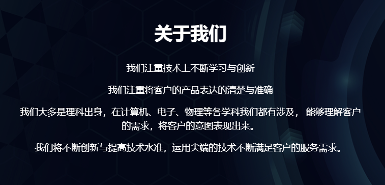
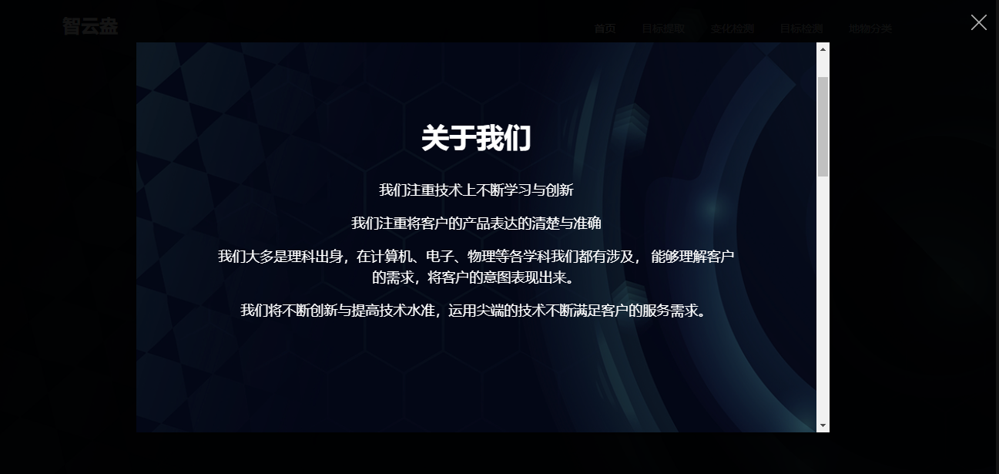
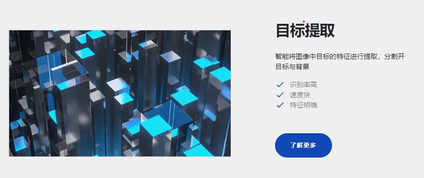
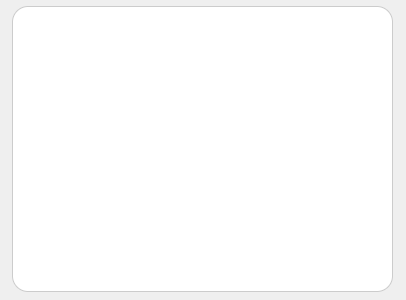
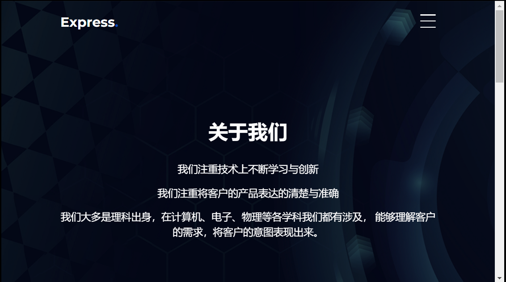

<div align="center">
<h1> 智云盎-基于百度飞桨的遥感图像智能解译平台详细技术文档</h1>
</div>

## 项目介绍


## 背景背景


## 平台介绍


## 应用场景


## 技术路线
### 模型训练与部署


### Web后端
* 总体架构：使用 [Django](https://github.com/django/django/) 框架进行搭建，并在Django框架中结合 [PaddleRS](https://github.com/PaddleCV-SIG/PaddleRS/) 实现模型的加载与推理。
* 具体技术实现：
  * `核心文件说明`：./SoftwareCupA4/a4project的文件中的核心文件结构（部分文件）。文件树如下：

    ```
    ├── a4project               # 项启动目配置文件
    │     ├── __init__.py      
    │     ├── settings.py       # 项目配置文件，用于配置项目的启动参数配置
    │     ├── urls.py           # 项目整体路由配置
    │     └── wsgi.py           
    ├── predictapi              # 图片处理、模型推理的api
    │     ├── migrations 
    │     ├── apps.py           #图片处理、模型推理的api的配置
    │     ├── urls.py           #理的api的路由配置
    │     └──views.py           #理的api的视图函数文件，处理图片与进行模型推理
    └── zya                     # 智云盎app
          └──views.py           #智云盎的视图函数文件，接收和处理浏览器的http请求，调用模型推理的api，发送http响应。
    ```
  * `模型推理api实现`：
    * 使用Django的request.POST.get()方法接收来自前端post请求的图片base64数据。
      ```
        if request.method == 'POST':
           # 获取处理图的base64
           image1 = str(request.POST.get('b64image1'))
           image1 = bytes(image1, 'utf-8')
      ```
    * 使用opencv库和base64库将前端的通过base64编码后的图片数据进行解码操作，将图片转换为opencv图片类型。
      ```
        image1 = base64_cv2(image1, cv2.IMREAD_COLOR)
      ```
    * 使用PaddleRS的Predictor()函数加载训练好的目标检测、变化检测、目标提取、地物分类4个遥感卫星图片推理模型。
      ```
         odPredictor = Predictor(model_dir + "/od", use_gpu=True)
      ```
    * 使用PaddleRS的predict（）函数将输入处理后的opencv图片经模型推理处理后，输入处理后的opencv图片。
      ```
         result = odPredictor.predict(image1)
      ```
    * 将处理后的opencv图片进行后处理等相关操作，并将图片编码为base64类型的数据。
      ```
         outputimagebs64 = cv2_base64(result)
      ```
    * 将处理后编码为base64类型的数据以json类型返回给前端。
      ```
        data = {}
        data['status'] = 'success'  # 处理成功状态信息
        data['result'] = 'data:image/png;base64,'+str(outputimagebs64,'utf-8')#增加data:image/png;base64,才能在浏览器显示
        return JsonResponse(data)  # 向前端返回处理后图片的data数据
      ```
  * `智云盎app实现`：
    * 使用Django的request.method()方法判断前端的http请求类型。
    * 如果为http的get请求类型，则使用django.shortcuts的render()方法将对应的前端首页、目标检测、变化检测、目标提取、地物分类功能页以http报文形式发送给前端，实现前端页面数据的传输。
      ```
        if request.method == "GET":
           return render(request, 'index.html')
      ```


### Web前端

* 概述
  * 采用[Scss](https://www.sass.hk/) 、[Bootstrap](https://www.bootcss.com/) 、[Glightbox](https://biati-digital.github.io/glightbox/) 、[Jquery](https://jquery.com/) 来辅助构建整体的网页界面。
  * 用Djano来搭建网页之间的路由。
* 总体设计
   * 首页
     <div></div>
   * 功能页面
     1. 目标提取
        <div></div>
     2. 变化检测
        <div></div>
     3. 目标检测
        <div></div>
     4. 地物分类
        <div></div>
     5. 关于我们
        <div></div>
* 功能实现
   * 滚动动画
     * 通过JQuery动画库进行设计实现。

   * 小窗口动画
     * 通过Glightbox实现。
       <div></div>
      

   * 动画延时
     * 通过js的counter计数器来实现对时间的计时，再通过函数判断进行延时。

   * 导航栏
     * 通过Bootstrap帮助设计实现
       <div></div>
      
      

   * 数据通信
      
      通过ajax来向服务器发起POST请求输出图片Base64加密后，通过json进行传输。
      ```
      function post(){
        $.ajax({
            url:"",    //调用目标检测api，
            type:'POST',                  // 相当于form 中的 method
            data:{'b64image1':img},         // 将数据传到后端
            dataType: "json",             // 注意这个定义的是返回值的类型，不是发送数据的类型，如果返回类型不是json类型，则会进入error函数
            headers: { "X-CSRFToken": "{{ csrf_token }}" },//Django中表单提交都需要csrf验证
            success: function (arg) {     // 后端返回成功后的回调函数,data为后端传来的数据
                if(arg.status==="success"){//处理成功  arg.status为后端返回的处理状态，值为success表示api处理成功
                    $("#viewImg1").attr("src",arg.result);//在image的src属性赋值为处理后的base64值，浏览器可直接显示
                // $("#i").val(arg.data);
                $("#ntfText").html("处理成功");
            }
            else{
                $("#ntfText").html("发起失败");
            }
            },
            error:function(){
            }
        });
	  }
   * 内部实现
   
      **注：具体的样式代码设计见文件**
      1. [基础](../a4project/static/scss/components/_site-base.scss)
         1. 窗体
         2. 字号
         3. 按钮
            <div></div>
         4. 预加载样式
      2. [导航栏](../a4project/static/scss/components/_site-navbar.scss)
         1. 菜单
            <div></div>
         2. 在手机上显示的侧边栏菜单
            <div></div>
      3. [功能块](../a4project/static/scss/components/_site-blocks.scss)
         1. 盒子box
            <div></div>
         2. 图片展示盒
            <div></div>
      4. [页脚](../a4project/static/scss/components/_site-footer.scss)
         <div></div>


## 需求规格及使用说明
* 需求规格
  * 硬件需求：8核CPU及其以上，内存大于等于8GB，如有GPU可支持GPU进行推理。
  * 软件需求：Linux操作系统（推荐使用Linux ubuntu-18.04），安装python 3.7/3.8版本，使用GPU进行推理时应当安装cuda 11.2版本。
  * 主要依赖库需求（具体的所有依赖文件请查看requirements.txt文件）：
    * paddle==1.0.1
    * paddle-bfloat==0.1.2
    * paddlepaddle==2.3.0rc0(使用CPU推理)
    * paddlepaddle-gpu==2.3.0.post112(使用GPU推理,且cuda版本为11.2)
    * paddlers==1.0b0
    * paddleslim==2.2.2
    * Django>=2.2.1
    * visualdl >= 2.1.1
    * opencv-contrib-python == 4.3.0.38
  * 环境配置
    * 下载python 3.7及以上版本，具体请参考 [python](https://www.python.org/downloads/) 查看安装前的准备及安装过程。
    * 下载安装cuda 11.2 ，具体请参考[nvidia CUDA](https://developer.nvidia.com/cuda-11.2.0-download-archive) 查看安装。
    * 在./SoftwareCupA4/a4project目录下，使用pip安装： `pip install -r requirements.txt`下载项目运行依赖包。
    * 将压缩包model.zip文件进行解压，将demo_data、deploy_model添加到./SoftwareCupA4/a4project目录中。
    * 然后终端下执行:
    * ```bash
         python manage.py makemigrations
         python manage.py migrate
      ```
    * 创建超级用户，在终端下执行:
    * ```bash
        python manage.py createsuperuser
       ```
    * 开始运行，在终端下执行:
    * ```bash
        python manage.py runserver
      ```
    * 至此即可浏览器打开: http://127.0.0.1:8000/zya/index 运行本项目。
  * 使用说明
    * 项目文件说明：
    这部分将展示SoftwareCupA4的文件结构全貌。文件树如下：

     ```
    ├── a4project             # 项目源代码文件
    │     ├── a4project       # Web服务器端口、路由、wsgi等配置文件
    │     ├── demo_data       # 测试图片
    │     ├── deploy_model    # 推理的模型文件
    │     ├── PaddleRS        # PaddleRS源码文件
    │     ├── predictapi      # 功能模型的推理api源码
    │     ├── static          # 静态资源文件
    │     │     ├── css       # 页面样式文件
    │     │     ├── images    # 页面图片文件
    │     │     └── js        # 页面js文件
    │     ├── templates       # 前端html模板文件
    │     └── zya             # Web基础功能源码文件
    └── docs                  # 整个项目文档及图片    
    ```
    * 路由说明：
      * `主机IP:端口号/zya/index`智云盎Web首页
      * `主机IP:端口号/zya/bhjc`智云盎变化检测功能页面
      * `主机IP:端口号/zya/mbjc`智云盎目标检测功能页面
      * `主机IP:端口号/zya/mbtq`智云盎目标提取功能页面
      * `主机IP:端口号/zya/dwfl`智云盎地物分类功能页面
      * `主机IP:端口号/zya/about`智云盎关于我们功能页面
    * 操作页面说明：
      * `智云盎Web首页页面`：可选择智云盎Web的“变化检测”、“目标检测”、“目标提取”、“地物分类”、“关于我们”功能。
           <div></div>
       
      * `智云盎变化检测页面`：提供遥感图片的建筑物变化检测功能，点击“选择图片1”、“选择图片2”2个按钮上传两张要处理的图片，点击“生成图片”按钮对图片进行分析推理，并显示分析结果。
           <div></div>
           <div></div>
           <div></div>
      * `智云盎目标检测页面`：提供遥感图片的运动场检测功能，点击“选择图片”按钮上传1张要处理的图片，点击“生成图片”按钮对图片进行分析推理，并显示分析结果。
           <div></div>
           <div></div>
      * `智云盎目标提取页面`:提供遥感图片的道路提取功能，点击“选择图片”按钮上传1张要处理的图片，点击“生成图片”按钮对图片进行分析推理，并显示分析结果。
           <div></div>
           <div></div>
      * `智云盎地物分类页面`:提供遥感图片的分类功能，点击“选择图片”按钮上传1张要处理的图片，点击“生成图片”按钮对图片进行分析推理，并显示分析结果。
           <div></div>
           <div></div>
      *  `智云盎关于我们页面`:查看智云盎团队信息，方便与智云盎团队联系。
           <div></div>
    
## 团队介绍

