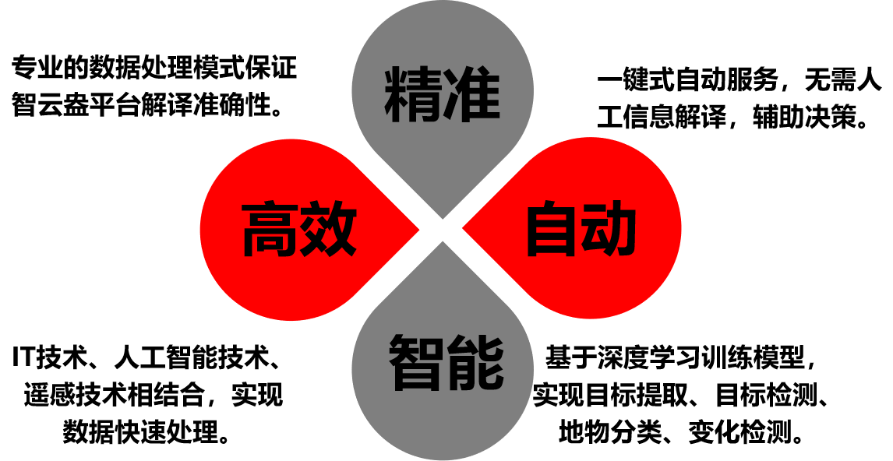

<div align="center">
<h1> 智云盎-基于百度飞桨的遥感图像智能解译平台</h1>
<h1>详细技术文档</h1>
</div>

## 1. 项目介绍
* 在新型城市建设和规划中，以卫星遥感图像处理为代表的地理信息技术正在发挥非常重要的作用，通过对城市范围内的人、事件、基础设施和环境等要素全面感知、实时动态识别和快速目标提取，为智慧城市的建设提供更多有价值的信息。
* 智云盎遥感智能解译平台从目标提取、变化检测、目标检测和地物分类四大分析功能入手，借助百度飞浆提供的部分模型进行搭建，通过人工智能技术快速、及时、低成本地从海量的遥感卫星影像中提取地物要素信息，可以实现科学、高效、智能地助力国土资源调查、地理国情普查、生态环境监测、城市规划建设、国防建设等行业应用。智云盎在能够实现遥感图像解析基础功能的前提下，具有高效处理、快速可视化展示等特点，将有效助力卫星影像处理技术的服务应用。

## 2. 项目背景
* 遥感数据具有覆盖范围及时域广、获取迅速、动态信息强等特点，已广泛应用于城市规划、气象预测、环境保护、防灾减灾、农林业监测等领域并取得了良好的经济和社会效益。
* 近年来，随着遥感技术的进一步发展和新一代高分辨率卫星系统相继投入应用，我国遥感领域已步入了高分辨率影像的快车道，对遥感数据的分析应用服务需求与日俱增。
* 传统方式对高分辨率卫星遥感图像的特征刻画能力差且人工成本高。深度学习算法模型不断涌现，给遥感影像解译带来了新的方法与契机。随着人工智能及深度学习技术快速发展，遥感技术对新型解译能力的需求迫切，针对计算机视觉的常规任务如语义分割、目标检测、变化检测的研究井喷式增长。较传统的人工目视解译和结合先验知识的技术，深度学习具有显著优势，能够大幅度提高卫星影像的解译生产力。
* 通过应用深度学习技术可以加速遥感领域智能化应用，促进遥感数据处理走向智能化，遥感技术与人工智能技术的结合，将人工智能赋能遥感技术，贯穿海量多源异构数据从处理分析到共享应用的全链路，在大幅缩短遥感图像解译周期、提高解译精准度的同时催生新的遥感应用领域，促进遥感技术应用的变革。

## 3. 平台介绍
* “智云盎——为您提供一键式智能解译遥感影像服务”，智云盎遥感智能解译平台基于深度学习技术解译遥感影像，从多个角度提升遥感影像的自动化分析以及应用能力。平台从目标提取、变化检测、目标检测和地物分类四大分析功能入手，将地理空间大数据、人工智能模型生产、人工智能遥感解译等业务融合于统一流程中，形成AI闭环，力求提供快速、有价值的遥感信息服务，具备高效处理及快速可视化展示，智能化深度学习框架集成等特点。
* 智云盎平台特点介绍如下：
  <div></div>
* 智云盎首页面如下图：
  <div></div>
### 3.1 目标提取服务：
智云盎目标提取服务为“道路”为要素，用户一键式上传待检测图像即可得到反馈结果。道路信息不仅是基础的地理信息，且为提取其他地物提供了参考，在应急响应、智慧城市、车辆管理、无人机导航等多个领域发挥重要作用。
  * 目标提取功能进入页面如下：
    <div></div>
  * 前后图像目标提取变化如下图：
    <div></div>
### 3.2 目标检测服务：
智云盎提供一键式目标检测服务，用户登录页面后进入该功能页面进行原始遥感图像上传，借助百度飞桨平台提供的模型将图像中的“操场”这一物体作为目标进行快速提取，提取结果具有高准确率特点。
  * 目标检测功能进入页面如下：
    <div></div>
  * 图像目标检测前后如下图：
    <div></div>
### 3.3 变化检测服务：
智云盎针对相同地理位置下的“建筑物”这一元素进行不同时间环境下图像信息的变化检测。用户通过上传两张不同时间的相同地域图像，即可实现城市建筑物变化的动态监测，该技术能够有效辅助城市管理等部门及时发现并依法查处各类违法建筑物，同时为处理城市灾害和紧急情况提供高质量的直观的空间信息支持，具有重要意义。
  * 变化检测功能进入页面如下：
    <div></div>
  * 上传两张不同时间下相同地理位置的图像：
    <div></div>
  * 变化检测结果如图：
    <div></div>
### 3.4 地物分类服务：
智云盎通过区分地面与其他三类达到快速完成地物分类的目标，将丰富的地表信息进行规划，用户一键式上传图像，执行分类功能即可快速得到分类结果，该技术可后续在土地覆盖检测、森林覆盖检测等领域得到更加广泛的应用。
  * 地物分类功能进入页面如下：
    <div></div>
  * 图像地物分类前后对比如下图：
    <div></div>


## 4. 应用场景
* 大多数遥感处理平台的重要使命是完成卫星影像的辐射定标和几何校正，智云盎遥感智能解译平台则是借助人工智能技术完成卫星影像数据的看得懂，即通过由数据到决策的转换，为用户提供更丰富的信息服务。
* 智云盎遥感智能解译平台有关目标提取板块针对“道路”这一元素进行信息提取。道路信息的提取是遥感图像解译领域研究热点，道路不仅是基础的地理信息，而且为提取其他地物提供了参考。道路信息在应急响应、智慧城市、车辆管理、城市规划、交通导航、无人机导航以及无人驾驶车路径规划和交通管理等多个领域发挥重要作用。
目标提取是指单幅图像或序列图像中将感兴趣的目标与背景分割开来，从图像中识别和解译有意义的物体实体而提取不同的图像特征的操作。目标提取在计算机视觉提取人脸特征和指纹等，在摄影测量与遥感中，用于特征点线的提取来进行影像匹配和三维建模等领域都有着广泛应用。
* 智云盎遥感智能解译平台有关变化检测板块针对相同地理位置下的“建筑物”这一元素进行不同时间环境下图像信息的变化检测。通过城市建筑物变化动态监测，全面掌握城市建筑物的规划实施情况，将变化量与城市规划比对，能够有效辅助城市管理等部门及时发现并依法查处各类违法建筑物，同时为处理城市灾害和紧急情况提供高质量的直观的空间信息支持，为政府宏观决策和依法行政提供科学依据。
同时，变化检测这一技术在资源和环境监测中的土地利用和覆盖变化、森林和植被变化、城市扩展等变化信息获取；地理空间数据更新；地震、洪水、泥石流和森林大火等灾情监测与评估；毁伤效果评估、战场信息动态感知、军事目标和兵力部署监测等方面也有着重要应用。
* 智云盎遥感智能解译平台有关目标检测板块针对“操场”这一元素进行目标信息检测。目标检测的任务是找出图像中所有感兴趣的目标并确定类别和位置，在自动驾驶、图像理解、智慧城市等领域都有非常广泛的应用。
目标检测将目标的分割和识别合二为一，其准确性和实时性是整个系统的一项重要能力。尤其是在复杂场景中，需要对多个目标进行实时处理时，目标自动提取和识别就显得特别重要。随着计算机技术的发展和计算机视觉原理的广泛应用，利用计算机图像处理技术对目标进行实时跟踪研究越来越热门，对目标进行动态实时跟踪定位在智能化交通系统、智能监控系统、军事目标检测及医学导航手术中手术器械定位等方面具有广泛的应用价值。
*遥感影像提供了目标区域的极为丰富的、复杂的大量数据，反映着各种地表信息。影像处理的最终目的是确定影像上的某些目标与地物之间的对应关系，从而达到认识地物状态的目的。遥感影像作为检测地物情况最直接的途径，在地物分布情况的研究过程中发挥了重要作用，遥感影像在土地覆盖检测、森林覆盖检测、草地覆盖检测、湿地覆盖检测等领域已经得到广泛的应用。


## 5. 技术路线
### 5.1 模型训练与部署
#### 5.1.1 百度飞桨开源深度学习平台
百度飞桨（PaddlePaddle）以百度多年的深度学习技术研究和业务应用为基础，集深度学习核心训练和推理框架、基础模型库、端到端开发套件、丰富的工具组件于一体，是中国首个自主研发、功能丰富、开源开放的产业级深度学习平台。

飞桨是百度公司经13年研发与及积累而构建的人工智能基础平台与核心技术，作为国内首个自主研发、开源开放、功能完备的深度学习平台，让应用人工智能技术的门槛更低、成本更少、效率更高，对于推进自主可控的人工智能产业发展具有重要意义。

#### 5.1.2 PaddleRS 高性能遥感图像处理开发套件

PaddleRS是遥感科研院所、相关高校共同基于飞桨开发的遥感处理平台，支持遥感图像分类，目标检测，图像分割，以及变化检测等常用遥感任务，帮助开发者更便捷地完成从训练到部署全流程遥感深度学习应用。

本项目的深度学习算法设计均使用基于PaddlePaddle飞桨框架开发的遥感图像处理框架，该套件能够在百度AI Studio平台上较好的适配，便于使用百度飞桨提供的高算力显卡进行模型的训练与部署测试。本项目使用该框架提供的多个SOTA模型作为基础，对模型进行进一步修改，从而在多个遥感图像解译任务上都取得了比较好的效果。

#### 5.1.3 变化检测算法设计
本项目变化检测算法的实现基于LEVIR小组于2021年发布的作品——基于Transformer的遥感图像变化检测模型BIT-CD，原论文[链接](https://ieeexplore.ieee.org/document/9491802)
，原作者官方实现的[链接](https://github.com/justchenhao/BIT_CD)
。BIT-CD模型是目前遥感变化检测领域的SOTA模型之一，通过提出一种双时相图像转换器，更高效的通过非局部自注意力机制对时空域内的上下文进行建模。这种设计使得BIT-CD在三个变化检测数据集上，依靠无复杂结构的朴素骨干网络取得了超远多个SOTA算法的效率和准确度。

本项目在官方提供的Baseline基础上进行模型结构、数据集增强、后处理设计等多方面的增强，并利用飞桨平台提供的后台任务等功能提高训练速度，达到了F1得分0.87944，其分割准确率在测试集上更是达到了92%的效果。基于本项目实现方法在AI Studio平台开源的两个适用于比赛的子项目（[链接](https://aistudio.baidu.com/aistudio/projectdetail/4014610?contributionType=1)
）也取得了超过70次Fork。

BIT-CD的模型示意见下图


变化检测效果见下图


#### 5.1.4 目标提取算法设计

本项目的目标提取算法数据集使用Massachusetts Roads道路提取数据集，该数据集的训练集包含804幅大小为1500x1500的三波段影像，每幅影像均配有道路提取标签。

目标提取算法基于DeepLab V3+模型开发，该模型是一个基于DeepLab V3设计的语义分割网络，在其基础上添加了一个简单但非常有效的Decoder解码器对模型结果，尤其结果中的边界进行细分，从而得到更好的检测效果。

DeepLab V3+模型示意见下图


目标提取效果见下图


#### 5.1.5 目标检测算法设计

本项目的目标检测算法使用RSOD遥感影像目标检测数据集，该数据集是由武汉大学于2017年发布的数据集，其中包含共4种类型的遥感地物目标。

目标检测算法使用百度研发的基于PaddlePaddle的高效目标检测器PP-YOLO，作为YOLO系列中比较新的一代模型，其吸纳了多种能提高速度和准确率的技术，并在YOLOv3的基础上进行了许多种改进，以达到一个比较好的效果。另外，基于经过大数据集预训练过的PP-YOLO模型进行训练的结果能取得更优异的结果。

PP-YOLO模型示意见下图


目标检测效果见下图


#### 5.1.6 地物分类算法设计

本项目的地物分类算法使用了飞桨常规赛：遥感影像地块分割赛题中使用的数据集，旨在对遥感影像进行像素级内容解析，对遥感影像中感兴趣的类别进行提取和分类。数据集中包含了建筑、道路、林地等多个类别，用于衡量模型对遥感影像的分割效果。

本项目地物分类算法同样基于DeepLab V3+模型开发，通过对数据输入输出部分进行处理和修改，DeepLab模型能够对本项目的需求较好的适配。

地物分类效果见下图


#### 5.1.7 深度学习模型部署

本项目的遥感图像解译算法全部基于PaddleRS进行开发，因此对于PaddleRS的部署方案能够完美适配。PaddleRS对其模型使用Paddle Inference作为底层，对其推理部分进行了封装。将训练时使用的动态图结构通过PaddleRS提供的转换工具转换为静态图后，即可与后端代码进行适配，从而得到快速、准确的推理模型。

在本项目中模型的部署部分，基于统一的封装方式对4个不同功能的模型分别封装。通过向后端程序暴露特定方法，保证后端开发成员可以通过对Predictor类的方法调用进行推理。

为防止异常数据导致推理过程出现问题，在模型的静态图转换和Predictor推理方法中分别设置了针对异常数据的检查和处理方法，保证推理功能持续稳定运行。

### 5.2 Web后端
#### 5.2.1 总体架构：
使用 [Django](https://github.com/django/django/) 框架进行搭建，并在Django框架中结合 [PaddleRS](https://github.com/PaddleCV-SIG/PaddleRS/) 实现模型的加载与推理。
#### 5.2.2  具体技术实现：
  * `核心文件说明`：./SoftwareCupA4/a4project的文件中的核心文件结构（部分文件）。文件树如下：

    ```
    ├── a4project               # 项启动目配置文件
    │     ├── __init__.py      
    │     ├── settings.py       # 项目配置文件，用于配置项目的启动参数配置
    │     ├── urls.py           # 项目整体路由配置
    │     └── wsgi.py           
    ├── predictapi              # 图片处理、模型推理的api
    │     ├── migrations 
    │     ├── apps.py           #图片处理、模型推理的api的配置
    │     ├── urls.py           #理的api的路由配置
    │     └──views.py           #理的api的视图函数文件，处理图片与进行模型推理
    └── zya                     # 智云盎app
          └──views.py           #智云盎的视图函数文件，接收和处理浏览器的http请求，调用模型推理的api，发送http响应。
    ```
  * `模型推理api实现`：
    * 使用Django的request.POST.get()方法接收来自前端post请求的图片base64数据。
      ```
        if request.method == 'POST':
           # 获取处理图的base64
           image1 = str(request.POST.get('b64image1'))
           image1 = bytes(image1, 'utf-8')
      ```
    * 使用opencv库和base64库将前端的通过base64编码后的图片数据进行解码操作，将图片转换为opencv图片类型。
      ```
        image1 = base64_cv2(image1, cv2.IMREAD_COLOR)
      ```
    * 使用PaddleRS的Predictor()函数加载训练好的目标检测、变化检测、目标提取、地物分类4个遥感卫星图片推理模型。
      ```
         odPredictor = Predictor(model_dir + "/od", use_gpu=True)
      ```
    * 使用PaddleRS的predict（）函数将输入处理后的opencv图片经模型推理处理后，输入处理后的opencv图片。
      ```
         result = odPredictor.predict(image1)
      ```
    * 将处理后的opencv图片进行后处理等相关操作，并将图片编码为base64类型的数据。
      ```
         outputimagebs64 = cv2_base64(result)
      ```
    * 将处理后编码为base64类型的数据以json类型返回给前端。
      ```
        data = {}
        data['status'] = 'success'  # 处理成功状态信息
        data['result'] = 'data:image/png;base64,'+str(outputimagebs64,'utf-8')#增加data:image/png;base64,才能在浏览器显示
        return JsonResponse(data)  # 向前端返回处理后图片的data数据
      ```
  * `智云盎app实现`：
    * 使用Django的request.method()方法判断前端的http请求类型。
    * 如果为http的get请求类型，则使用django.shortcuts的render()方法将对应的前端首页、目标检测、变化检测、目标提取、地物分类功能页以http报文形式发送给前端，实现前端页面数据的传输。
      ```
        if request.method == "GET":
           return render(request, 'index.html')
      ```


### 5.3 Web前端
#### 5.3.1 概述
  * 采用[Scss](https://www.sass.hk/) 、[Bootstrap](https://www.bootcss.com/) 、[Glightbox](https://biati-digital.github.io/glightbox/) 、[Jquery](https://jquery.com/) 来辅助构建整体的网页界面。
  * 用Djano来搭建网页之间的路由。
#### 5.3.2 总体设计
   * 首页
     <div></div>
   * 功能页面
     1. 目标提取
        <div></div>
     2. 变化检测
        <div></div>
     3. 目标检测
        <div></div>
     4. 地物分类
        <div></div>
     5. 关于我们
        <div></div>
* 功能实现
   * 滚动动画
     * 通过JQuery动画库进行设计实现。

   * 小窗口动画
     * 通过Glightbox实现。
       <div></div>
      

   * 动画延时
     * 通过js的counter计数器来实现对时间的计时，再通过函数判断进行延时。

   * 导航栏
     * 通过Bootstrap帮助设计实现
       <div></div>
      
      

   * 数据通信
      
      通过ajax来向服务器发起POST请求输出图片Base64加密后，通过json进行传输。
      ```
      function post(){
        $.ajax({
            url:"",    //调用目标检测api，
            type:'POST',                  // 相当于form 中的 method
            data:{'b64image1':img},         // 将数据传到后端
            dataType: "json",             // 注意这个定义的是返回值的类型，不是发送数据的类型，如果返回类型不是json类型，则会进入error函数
            headers: { "X-CSRFToken": "{{ csrf_token }}" },//Django中表单提交都需要csrf验证
            success: function (arg) {     // 后端返回成功后的回调函数,data为后端传来的数据
                if(arg.status==="success"){//处理成功  arg.status为后端返回的处理状态，值为success表示api处理成功
                    $("#viewImg1").attr("src",arg.result);//在image的src属性赋值为处理后的base64值，浏览器可直接显示
                // $("#i").val(arg.data);
                $("#ntfText").html("处理成功");
            }
            else{
                $("#ntfText").html("发起失败");
            }
            },
            error:function(){
            }
        });
	  }
   * 内部实现
   
      **注：具体的样式代码设计见文件**
      1. [基础](../a4project/static/scss/components/_site-base.scss)
         1. 窗体
         2. 字号
         3. 按钮
            <div></div>
         4. 预加载样式
      2. [导航栏](../a4project/static/scss/components/_site-navbar.scss)
         1. 菜单
            <div></div>
         2. 在手机上显示的侧边栏菜单
            <div></div>
      3. [功能块](../a4project/static/scss/components/_site-blocks.scss)
         1. 盒子box
            <div></div>
         2. 图片展示盒
            <div></div>
      4. [页脚](../a4project/static/scss/components/_site-footer.scss)
         <div></div>


## 6. 需求规格及使用说明
### 6.1 需求规格
   ### 6.1.1 硬件需求：
8核CPU及其以上，内存大于等于8GB，如有GPU可支持GPU进行推理。
   ### 6.1.2  软件需求：
Linux操作系统（推荐使用Linux ubuntu-18.04），安装python 3.7/3.8版本，使用GPU进行推理时应当安装cuda 11.2版本。
   ### 6.1.3  主要依赖库需求：
（具体的所有依赖文件请查看requirements.txt文件）：
    * paddle==1.0.1
    * paddle-bfloat==0.1.2
    * paddlepaddle==2.3.0rc0(使用CPU推理)
    * paddlepaddle-gpu==2.3.0.post112(使用GPU推理,且cuda版本为11.2)
    * paddlers==1.0b0
    * paddleslim==2.2.2
    * Django>=2.2.1
    * visualdl >= 2.1.1
    * opencv-contrib-python == 4.3.0.38
### 6.2 环境配置
* 下载python 3.7及以上版本，具体请参考 [python](https://www.python.org/downloads/) 查看安装前的准备及安装过程。
* 下载安装cuda 11.2 ，具体请参考[nvidia CUDA](https://developer.nvidia.com/cuda-11.2.0-download-archive) 查看安装。
* 在./SoftwareCupA4/a4project目录下，使用pip安装： `pip install -r requirements.txt`下载项目运行依赖包。
* 将压缩包model.zip文件进行解压，将demo_data、deploy_model添加到./SoftwareCupA4/a4project目录中。
* 然后终端下执行:
* ```bash
     python manage.py makemigrations
     python manage.py migrate
  ```
* 创建超级用户，在终端下执行:
* ```bash
    python manage.py createsuperuser
  ```
* 开始运行，在终端下执行:
* ```bash
   python manage.py runserver
  ```
* 至此即可浏览器打开: http://127.0.0.1:8000/zya/index 运行本项目。
### 6.3  使用说明
#### 6.3.1  项目文件说明：
这部分将展示SoftwareCupA4的文件结构全貌。文件树如下：

 ```
├── a4project             # 项目源代码文件
│     ├── a4project       # Web服务器端口、路由、wsgi等配置文件
│     ├── demo_data       # 测试图片
│     ├── deploy_model    # 推理的模型文件
│     ├── PaddleRS        # PaddleRS源码文件
│     ├── predictapi      # 功能模型的推理api源码
│     ├── static          # 静态资源文件
│     │     ├── css       # 页面样式文件
│     │     ├── images    # 页面图片文件
│     │     └── js        # 页面js文件
│     ├── templates       # 前端html模板文件
│     └── zya             # Web基础功能源码文件
└── docs                  # 整个项目文档及图片    
```
#### 6.3.2 路由说明：
* `主机IP:端口号/zya/index`智云盎Web首页
* `主机IP:端口号/zya/bhjc`智云盎变化检测功能页面
* `主机IP:端口号/zya/mbjc`智云盎目标检测功能页面
* `主机IP:端口号/zya/mbtq`智云盎目标提取功能页面
* `主机IP:端口号/zya/dwfl`智云盎地物分类功能页面
* `主机IP:端口号/zya/about`智云盎关于我们功能页面
#### 6.3.3 操作页面说明：
* `智云盎Web首页页面`：可选择智云盎Web的“变化检测”、“目标检测”、“目标提取”、“地物分类”、“关于我们”功能。
           <div></div>
       
* `智云盎变化检测页面`：提供遥感图片的建筑物变化检测功能，点击“选择图片1”、“选择图片2”2个按钮上传两张要处理的图片，点击“生成图片”按钮对图片进行分析推理，并显示分析结果。
           <div></div>
           <div></div>
           <div></div>
* `智云盎目标检测页面`：提供遥感图片的运动场检测功能，点击“选择图片”按钮上传1张要处理的图片，点击“生成图片”按钮对图片进行分析推理，并显示分析结果。
           <div></div>
           <div></div>
* `智云盎目标提取页面`:提供遥感图片的道路提取功能，点击“选择图片”按钮上传1张要处理的图片，点击“生成图片”按钮对图片进行分析推理，并显示分析结果。
           <div></div>
           <div></div>
* `智云盎地物分类页面`:提供遥感图片的分类功能，点击“选择图片”按钮上传1张要处理的图片，点击“生成图片”按钮对图片进行分析推理，并显示分析结果。
           <div></div>
           <div></div>
*  `智云盎关于我们页面`:查看智云盎团队信息，方便与智云盎团队联系。
           <div></div>
    
## 7. 团队介绍
* 智云盎科技团队是一支年轻的高校队伍，成员专业涵盖软件工程、计算机科学与技术、通信工程，同学分工明确、搭配得当，分别负责模型训练与部署、web前端开发、web后端开发、技术文档撰写等内容，指导教师经验丰富，团队充满创新活力，展现高校计算机系学子风采。
